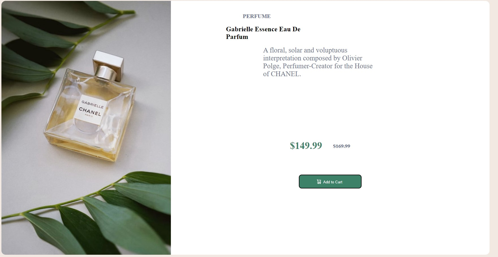

# Frontend Mentor - Product preview card component solution

This is a solution to the [Product preview card component challenge on Frontend Mentor](https://www.frontendmentor.io/challenges/product-preview-card-component-GO7UmttRfa). Frontend Mentor challenges help you improve your coding skills by building realistic projects. 

## Table of contents

- [Overview](#overview)
  - [The challenge](#the-challenge)
  - [Screenshot](#screenshot)
  - [Links](#links)
- [My process](#my-process)
  - [Built with](#built-with)
  - [What I learned](#what-i-learned)
- [Author](#author)

## Overview

### The challenge

Users should be able to:

- View the optimal layout depending on their device's screen size
- See hover and focus states for interactive elements

### Screenshot

### Links

- Solution URL: [Code Link](https://github.com/ShaunPour/Product-Preview-Card-Component)
- Live Site URL: [Live Site](https://shaunpour.github.io/Product-Preview-Card-Component/)

## My process
Given how straightforward this project was, there wasn't much of a process. I set up the basic html structure at the start and played around with the css to get the mobile first responsiveness working as I wanted it.

I went back to the html later to add a few more sections in order to get certain parts of it structured better though.

### Built with

- Semantic HTML5 markup
- CSS custom properties
- Flexbox

### What I learned
This project was very useful for getting back into using flex in a project - albeit on a smaller scale (I've been away from css for a while as most of my projects have been with Javascript where the css was provided, used bootstrap or done with React) and this project was great as a refresher.

## Author

- Website - [My Project Portfolio](shaunpourdev.com)
- Frontend Mentor - [@DarkPhoenixNinja92](https://www.frontendmentor.io/profile/DarkPhoenixNinja92)
